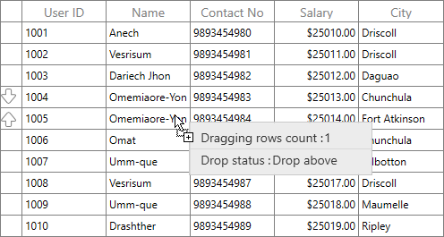
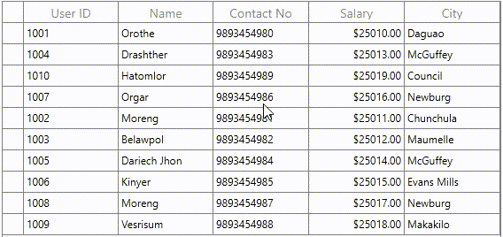
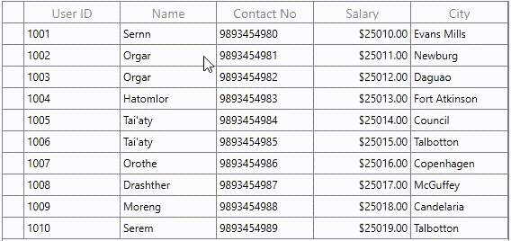

# How to reorder rows in wpf datagrid (row drag and drop)?

## About the sample
This example illustrates how to reorder rows in wpf datagrid (row drag and drop)

[WPF DataGrid](https://www.syncfusion.com/wpf-ui-controls/datagrid) (SfDataGrid) allows drag and drop the rows within and between controls by setting the [AllowDraggingRows](https://help.syncfusion.com/cr/wpf/Syncfusion.UI.Xaml.Grid.SfDataGrid.html#Syncfusion_UI_Xaml_Grid_SfDataGrid_AllowDraggingRows) and [AllowDrop](https://docs.microsoft.com/en-us/dotnet/api/system.windows.uielement.allowdrop?redirectedfrom=MSDN&view=net-5.0#System_Windows_UIElement_AllowDrop) property as **true**. It is also possible to drag and drop the rows between [SfDataGrid](https://help.syncfusion.com/cr/wpf/Syncfusion.UI.Xaml.Grid.SfDataGrid.html) and other controls such as **ListView** and [SfTreeGrid](https://help.syncfusion.com/cr/wpf/Syncfusion.UI.Xaml.TreeGrid.SfTreeGrid.html). SfDataGrid allows dropping rows when [AllowDrop](https://docs.microsoft.com/en-us/dotnet/api/system.windows.uielement.allowdrop?redirectedfrom=MSDN&view=net-5.0#System_Windows_UIElement_AllowDrop) is **true** and allows dragging when [AllowDraggingRows](https://help.syncfusion.com/cr/wpf/Syncfusion.UI.Xaml.Grid.SfDataGrid.html#Syncfusion_UI_Xaml_Grid_SfDataGrid_AllowDraggingRows) is **true**. 

```XML
<syncfusion:SfDataGrid x:Name="dataGrid1" Grid.Column="0"
                               AllowEditing="True"
                               ColumnSizer="Star"
                               AllowDraggingRows="True"
                               AllowDrop="True"
                               AutoGenerateColumns="False"                               
                               SelectionUnit="Row"
                               LiveDataUpdateMode="AllowDataShaping"
                               ItemsSource="{Binding UserDetails}" 
                               ShowRowHeader="True">
```


While dropping, the dragged records can be added above or below to the target record based on its drop position

For example, if you dropped record at the bottom of the targeted record, it will be added below the targeted record.


If you drop above the targeted record, it will be added above the targeted record



## Dragging multiple rows

[SfDataGrid](https://help.syncfusion.com/cr/wpf/Syncfusion.UI.Xaml.Grid.SfDataGrid.html) allows to drag multiple selected rows. To enable multiple selection, set the [SfDataGrid.SelectionMode](https://help.syncfusion.com/cr/wpf/Syncfusion.UI.Xaml.Grid.SfGridBase.html#Syncfusion_UI_Xaml_Grid_SfGridBase_SelectionMode) as **Multiple** or **Extended**.

```XML
<syncfusion:SfDataGrid x:Name="dataGrid1" Grid.Column="0"
                               AllowEditing="True"
                               ColumnSizer="Star"
                               AllowDraggingRows="True"
                               AllowDrop="True"
                               AutoGenerateColumns="False"
                               SelectionMode="Multiple"
                               SelectionUnit="Row"
                               LiveDataUpdateMode="AllowDataShaping"
                               ItemsSource="{Binding UserDetails}" 
                               ShowRowHeader="True">
```

#### Note: The drag selection cannot be performed while the [AllowDraggingRows](https://help.syncfusion.com/cr/wpf/Syncfusion.UI.Xaml.Grid.SfDataGrid.html#Syncfusion_UI_Xaml_Grid_SfDataGrid_AllowDraggingRows) enabled as true in the [SfDataGrid](https://help.syncfusion.com/cr/wpf/Syncfusion.UI.Xaml.Grid.SfDataGrid.html).



## Changing the row drop indicator

By default, the drop position will be indicated with arrows. To change the drop indicator as line, then set the [SfDataGrid.RowDropIndicatorMode](https://help.syncfusion.com/cr/wpf/Syncfusion.UI.Xaml.Grid.SfDataGrid.html#Syncfusion_UI_Xaml_Grid_SfDataGrid_RowDropIndicatorMode) as **Line**.

```XML
<syncfusion:SfDataGrid x:Name="dataGrid1" Grid.Column="0" Margin="10 0 10 0"
                               AllowEditing="True"
                               ColumnSizer="Star"
                               AllowDraggingRows="True"
                               AllowDrop="True"
                               AutoGenerateColumns="False"                               
                               SelectionMode="Multiple"
                               SelectionUnit="Row"
                               LiveDataUpdateMode="AllowDataShaping"
                               ItemsSource="{Binding UserDetails}" 
                               ShowRowHeader="True"
                               RowDropIndicatorMode="Line">
```



## Change the color of drag line indicator

[SfDataGrid](https://help.syncfusion.com/cr/wpf/Syncfusion.UI.Xaml.Grid.SfDataGrid.html) does not provide the direct support to change the color of drag line indicator. You can change the color of drag line indicator by overriding the [HeaderRowControl](https://help.syncfusion.com/cr/wpf/Syncfusion.UI.Xaml.Grid.HeaderRowControl.html) and [VirtualizingCellsControl](https://help.syncfusion.com/cr/wpf/Syncfusion.UI.Xaml.Grid.VirtualizingCellsControl.html) Template in [SfDataGrid](https://help.syncfusion.com/cr/wpf/Syncfusion.UI.Xaml.Grid.SfDataGrid.html).

For more information, please refer the KB [link](https://www.syncfusion.com/kb/12001/how-to-change-the-color-of-drag-line-indicator-in-wpf-datagrid-sfdatagrid)

## Row drag and drop between two DataGrid’s

To perform the dragging operation between two datagrid by using the [GridRowDragDropController.DragStart](https://help.syncfusion.com/cr/wpf/Syncfusion.UI.Xaml.Grid.GridRowDragDropController.html#Syncfusion_UI_Xaml_Grid_GridRowDragDropController_DragStart) , [GridRowDragDropController.Drop](https://help.syncfusion.com/cr/wpf/Syncfusion.UI.Xaml.Grid.GridRowDragDropController.html#Syncfusion_UI_Xaml_Grid_GridRowDragDropController_Drop) , [GridRowDragDropController.DragOver](https://help.syncfusion.com/cr/wpf/Syncfusion.UI.Xaml.Grid.GridRowDragDropController.html#Syncfusion_UI_Xaml_Grid_GridRowDragDropController_DragOver) and [GridRowDragDropController.Dropped](https://help.syncfusion.com/cr/wpf/Syncfusion.UI.Xaml.Grid.GridRowDragDropController.html#Syncfusion_UI_Xaml_Grid_GridRowDragDropController_Dropped) events.

You should enable [AllowDraggingRows](https://help.syncfusion.com/cr/wpf/Syncfusion.UI.Xaml.Grid.SfDataGrid.html#Syncfusion_UI_Xaml_Grid_SfDataGrid_AllowDraggingRows) and [AllowDrop](https://docs.microsoft.com/en-us/dotnet/api/system.windows.uielement.allowdrop?redirectedfrom=MSDN&view=net-5.0#System_Windows_UIElement_AllowDrop) property for the [SfDataGrid](https://help.syncfusion.com/cr/wpf/Syncfusion.UI.Xaml.Grid.SfDataGrid.html)’ s which are involved in row drag and drop operations. 

You can go through this [user guide](https://help.syncfusion.com/wpf/datagrid/drag-and-drop#row-drag-and-drop-between-two-datagrids) to know more about drag and drop between two DataGrid’s.

For more information, please refer the KB [link](https://www.syncfusion.com/kb/8210/how-to-make-row-drag-and-drop-between-sfdatagrid-with-other-controls)

Take a moment to peruse the [documentation](https://help.syncfusion.com/wpf/datagrid/drag-and-drop), where you can find about Row drag and drop, with code examples.

Please refer this [link](https://www.syncfusion.com/wpf-ui-controls/datagrid) to know about the essential features of Syncfusion WPF DataGrid.

## Requirements to run the demo
Visual Studio 2015 and above versions


